# Telecom Customer Churn Classification
Data science project of determining the primary drivers behind customers of a telecommunications company in California churning and building a classification model that can determine a customer's likelihood of churning to improve customer retention. 

## Quick Links
- Streamlit app for interactive data and model predictions analysis: [Streamlit App](https://telecom-customer-churn-classification.streamlit.app/)
- Power BI report of churn metrics by key variables: [Power BI Report](power_bi/report_gallery.md)
- Jupyter Notebook of the development of the churn classification model: [Jupyter Notebook](customer_churn_prediction.ipynb)
- Telecom customer churn dataset: [Telecom Customer Churn Dataset](telco-customer-churn-ibm-dataset/Telco_customer_churn.xlsx)
- Other projects I have made: [Portfolio Website](https://lucashoffschmidt.github.io/)

## Technologies Used
**Tools and Platforms**
- Development: Jupyterlab
- Visualization: Power BI 
- Deployment: Streamlit Community Cloud

**Libraries**
- Dataset Handling: `opendataset`
- Data Analysis: `pandas`, `numpy`
- Visualization: `matplotlib`, `seaborn`, `shap`
- Machine Learning: `scikit-learn`, `xgboost`
- Storage: `joblib`
- Deployment: `streamlit`

## Process
**Data Collection**
- Acquired the telecom customer churn data for customers in California, USA from kaggle and converted it to a pandas DataFrame.
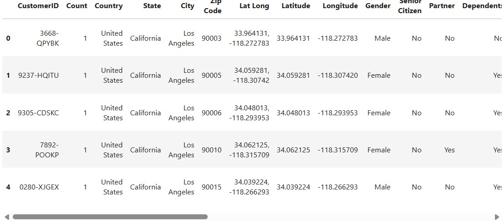
- Defined the attributes of the dataset.  

**Exploratory Data Analysis**
- Checked the dataframe for null values and incorrect data types and converted the Total Charges feature to float.
- Checked the statistical distribution of attributes and created a heatmap of numerical attribute correlations.
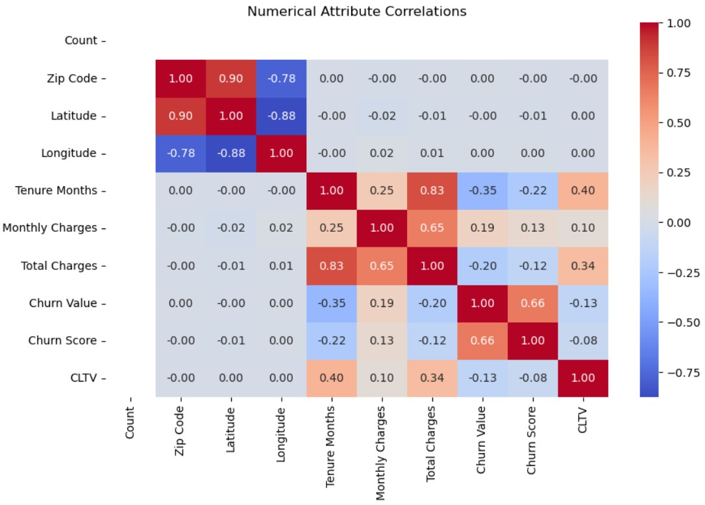
- Visualized how churn varies across categorical and numerical features using barplots and boxplots.
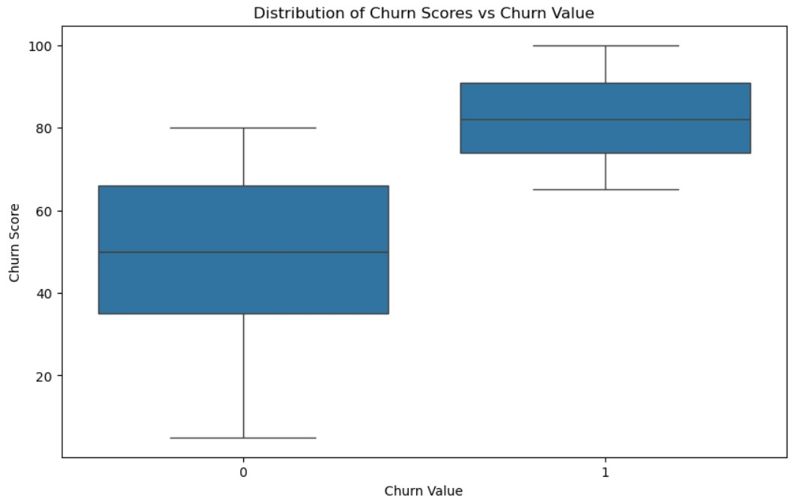
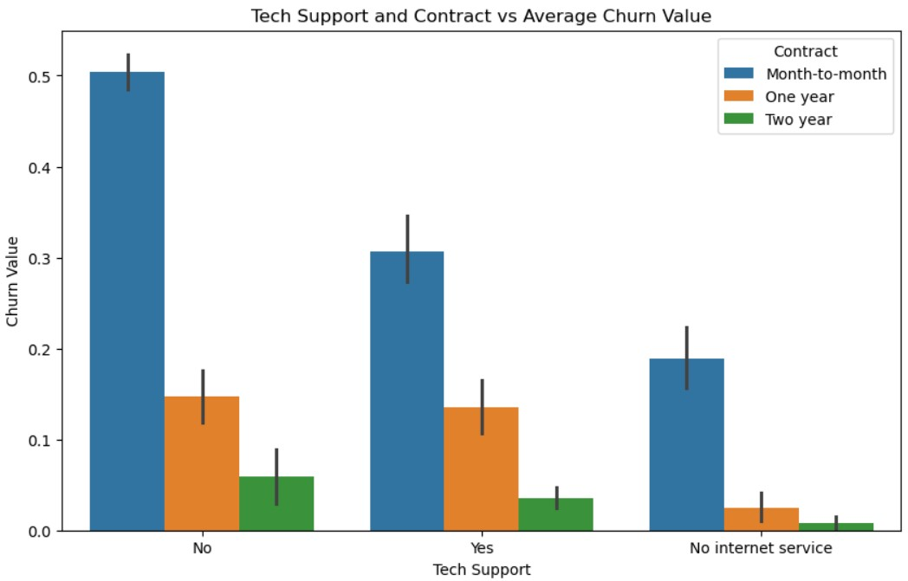
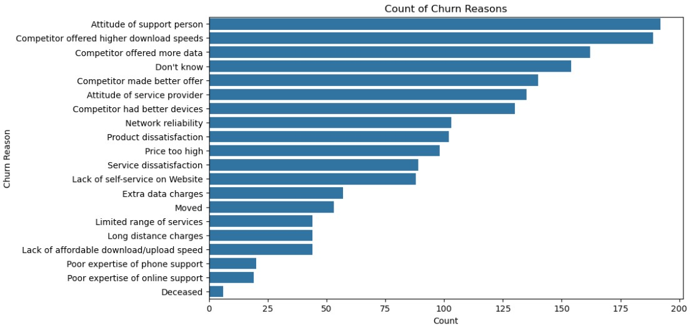
- Investigated how the average churn rate varies across cities.   

**Data Preprocessing**
- Checked the dataframe for duplicates, null values, high cardinality, typos and inconsistent casing.
- Handled leading and trailing spaces.
- Created aggregate features for high cardinality columns such as a "Monthly Charges Size" feature.
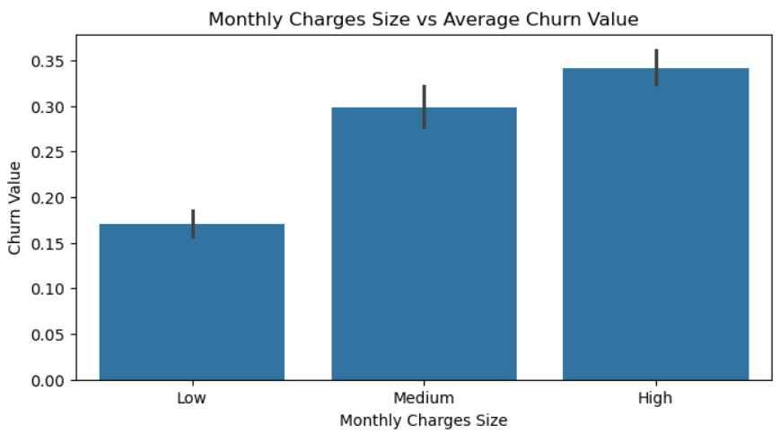
- Dropped any feature that were not suitable for modeling, such as high cardinality and constant value features.    

**Model Training and Evaluation**
- Split the data into training and testing dataframes, applied ordinal and one-hot encoding to categorical features and defined models along with their hyperparameter grids.
- Performed grid searches to find the best-performing model and evaluate models using f1-score, recall and accuracy.
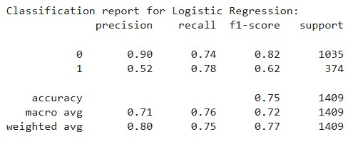
   

**Model Interpretation**
- Visualized the best-performing model's feature coefficients, SHAP summary plot, ROC curve and partial dependence plots for the most impactful features.     
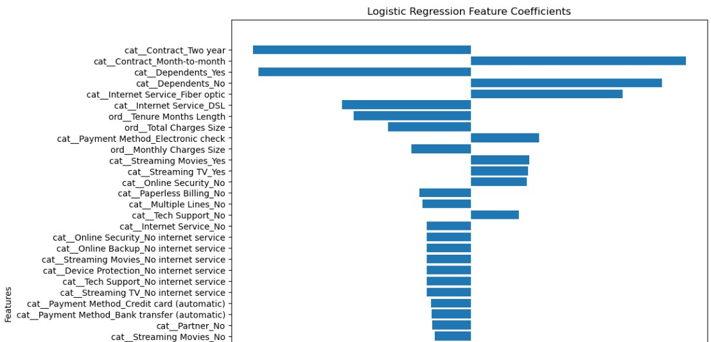
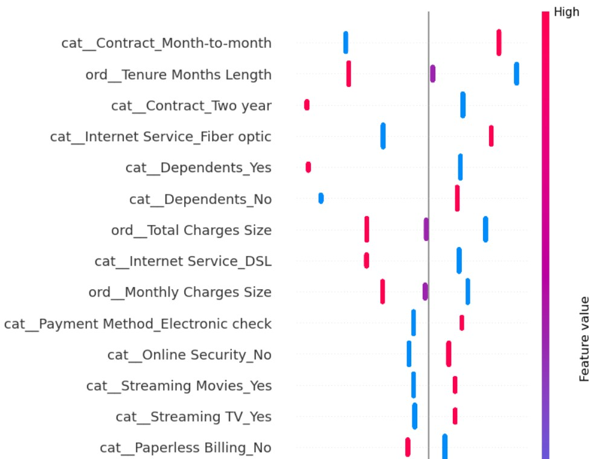
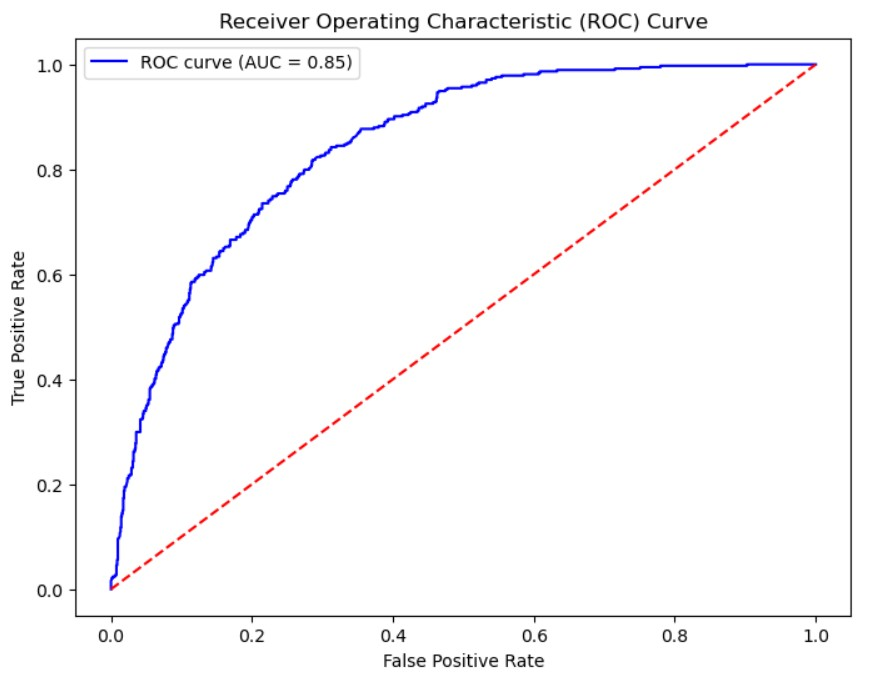
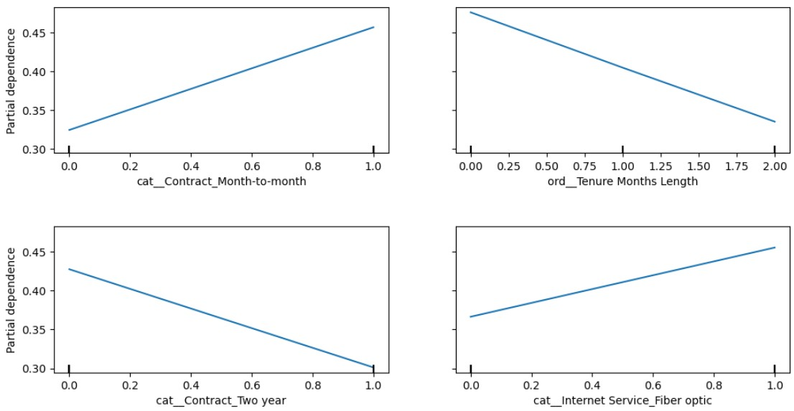

**Model Deployment**
- Saved data for use with Power BI and Streamlit. 
- Built a [Power BI Report](power_bi/report_gallery.md).
- Developed a [Streamlit App](https://telecom-customer-churn-classification.streamlit.app/) with dynamic visualizations and a SHAP-based localized feature importances plot and deployed it via the Streamlit Community Cloud.   

## Insights
- Seniors and single people churn significantly more than non-seniors and people with partners and dependents.
- Customers with higher internet speed churn more often.
- The attitude of the support person is listed as the number one reason for churning.
- Logistic Regression has been found to be the best churn classification model, correctly predicting whether a customer will churn or not 75% of the time, catching about 77% of real churners, and correctly classifying a customer as a churner 62% of the time. The model should therefore be used as an indicator that a customer might churn, but not as a surefire prediction tool.  

## Improvements
- These insights have been gathered on a relatively small dataset of about 7000 customers, so to ensure reliability it would be prudent to increase the size of the dataset.
- Techniques such as L1 and L2 regularization could be employed in an attempt to increase the accuracy of the model.
- We could utilize deep learning models, which increases the computational time it takes to train and evaluate models, but it could lead to a better-performing model. 
