# Dashboard Analysis Gallery of Telecom Customers Churn Metrics
## Complete dashboard
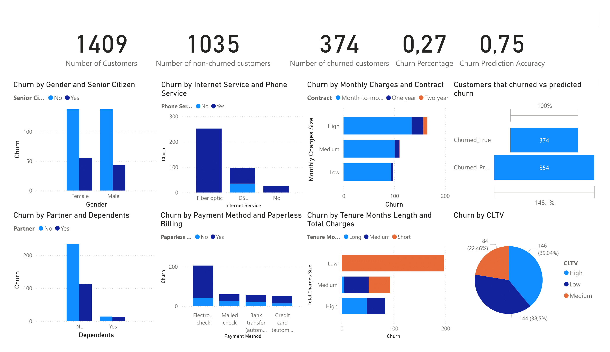

## 🚻 Gender
### Female
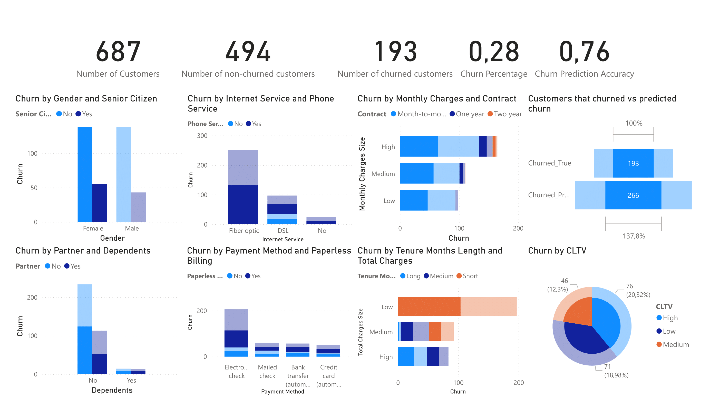
### Male
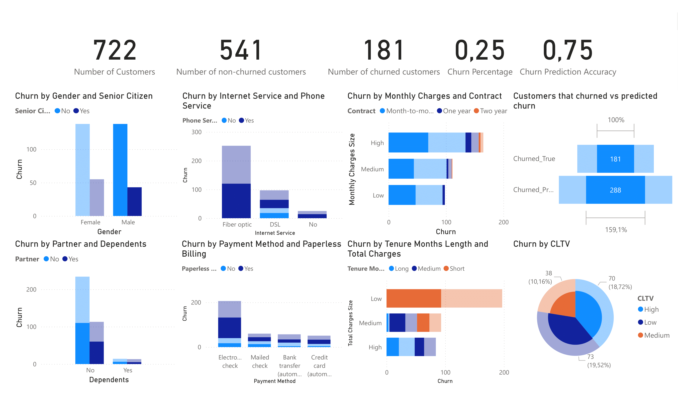

## 🌐 Internet service
### Fiber Optic
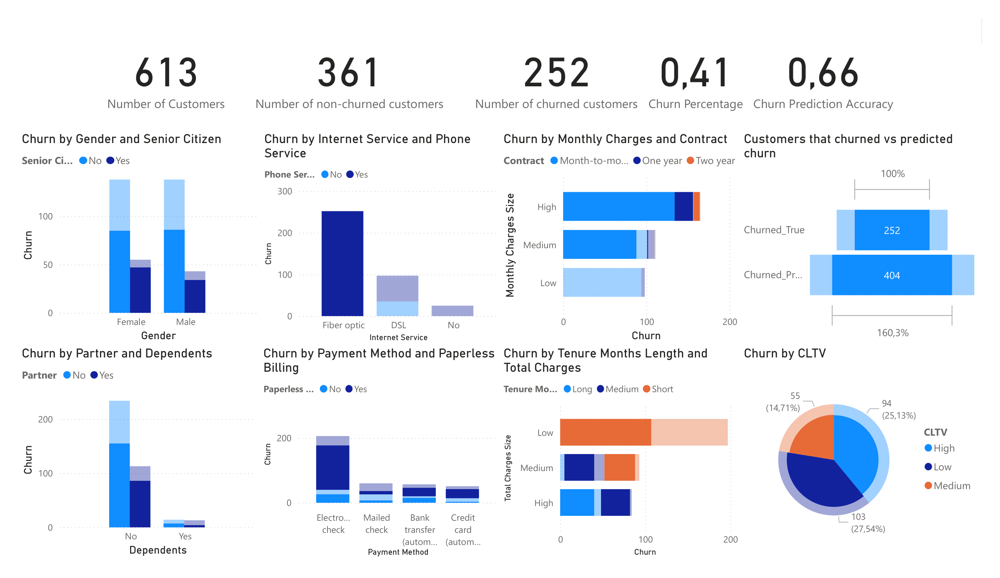

### DSL
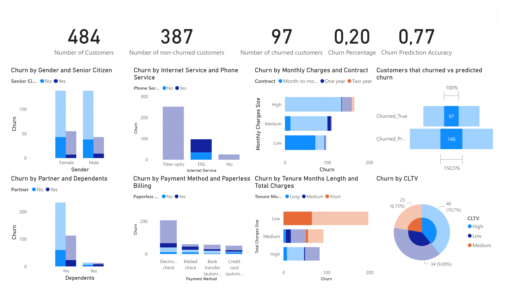

### No Internet Service

## 📅 Contract Length
### Month
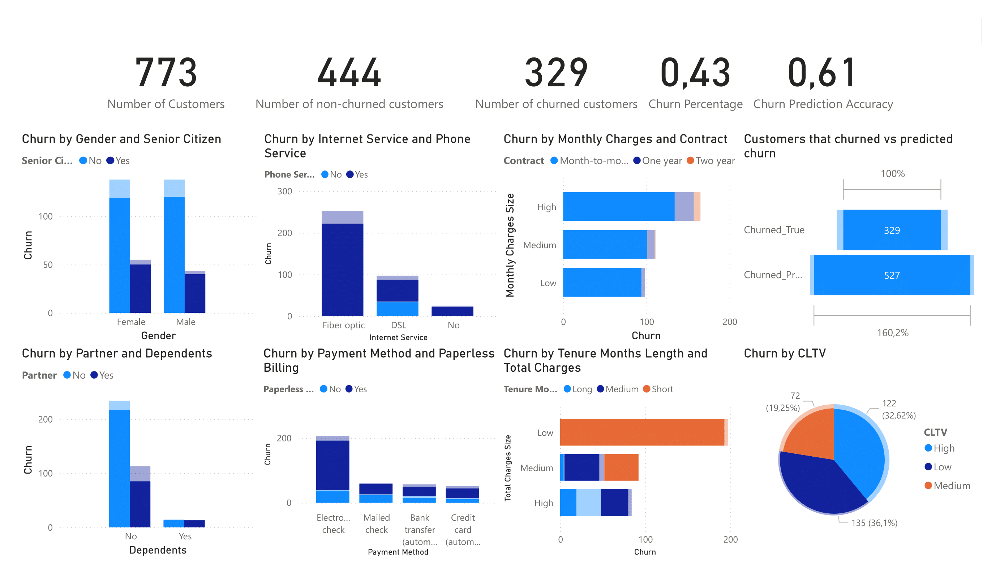

### 1 Year

### 2 Years

## 👪 Partner and Dependents
### Both Partner and Dependents
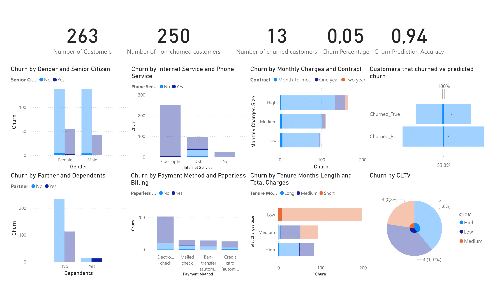

### Neither Partner nor Dependents
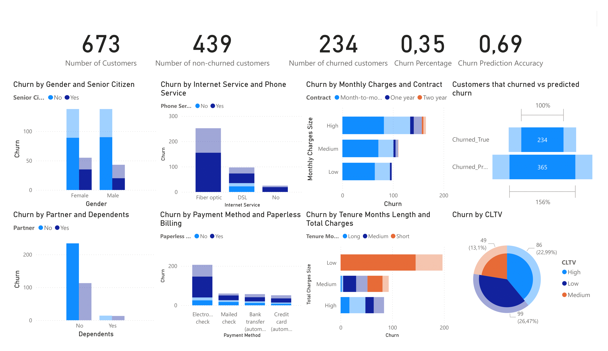

## 💳 Billing Type
### Paperless
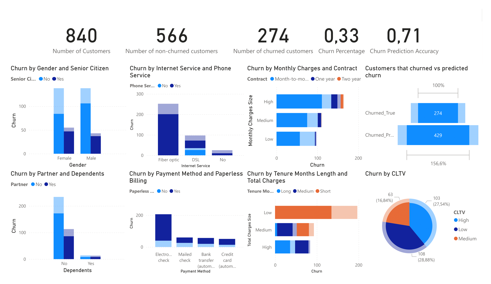

### Paper
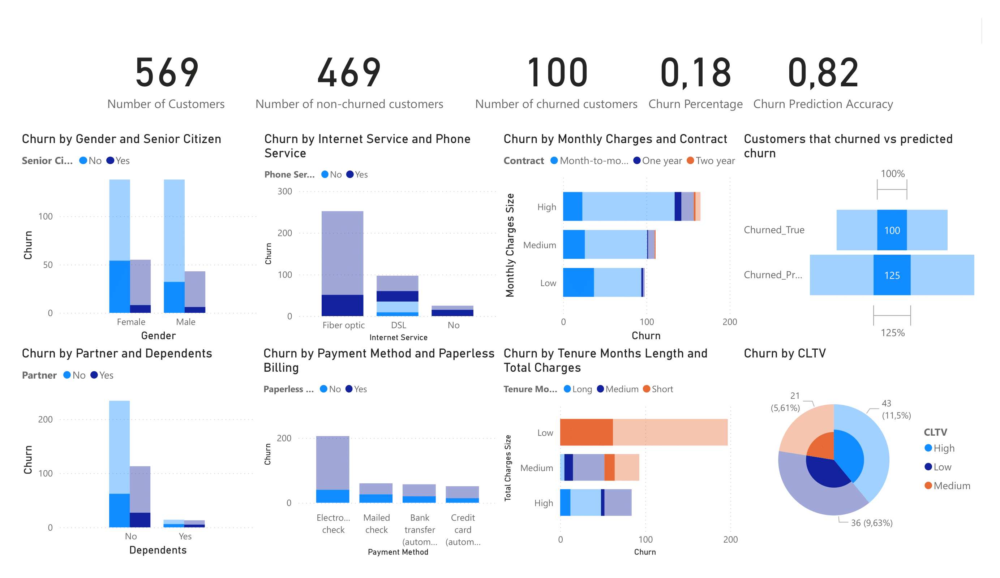

## ⏳Tenure Length
### Short Tenure
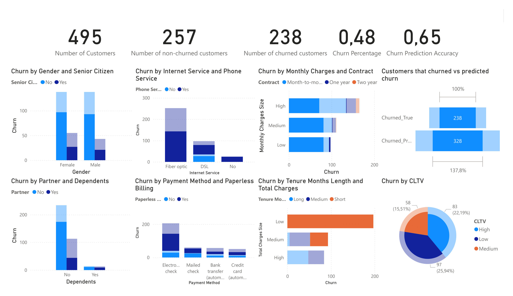

### Long Tenure
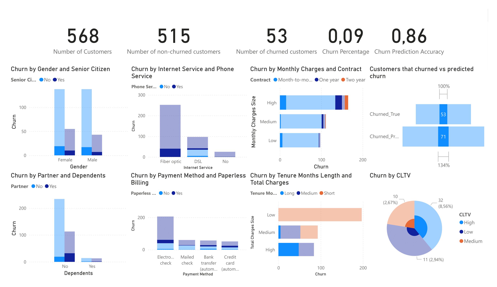

## 💰CLTV
### Low CLTV
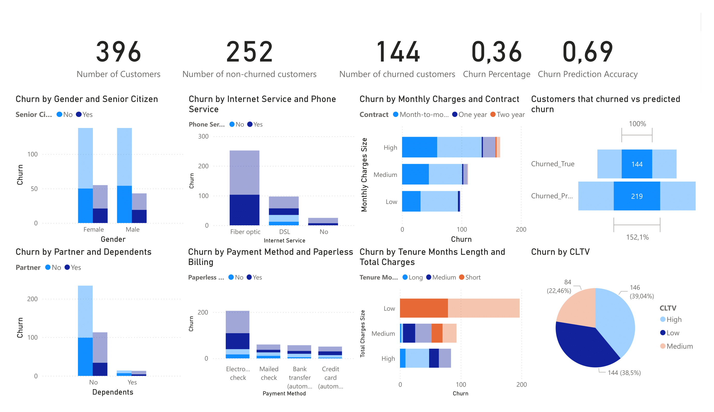

### High CLTV
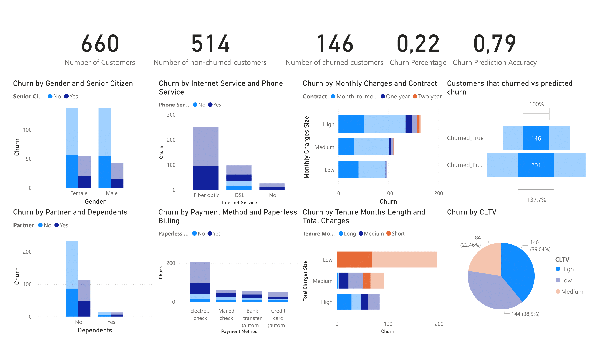
